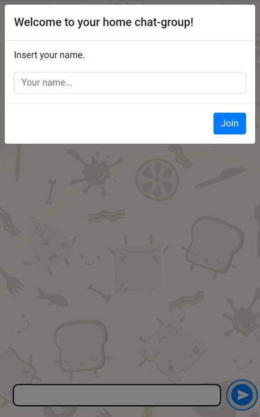
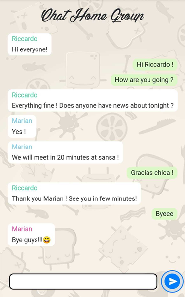

# Description

A really nice multi-client chat-group for mobile and desktop.

Really usefull to start other interesting projects.




## Installation

Download the project and open the terminal pointed to the project.

Use the package manager [yarn](https://yarnpkg.com/lang/en/) to install the project:


```bash
cd react
yarn install
cd ..
sh build.sh
cd server
yarn start
```

Take the ip address of your computer you used as server:

```bash
ifconfig
```

Point the mobile devices to :   **http://your.computer.ip.address:3000**


## Usage

To modify the client/react side you need a rebuild before starting again the server:

```bash
sh build.sh
```
